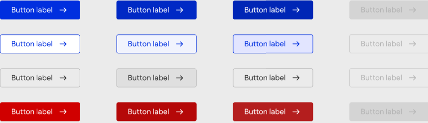
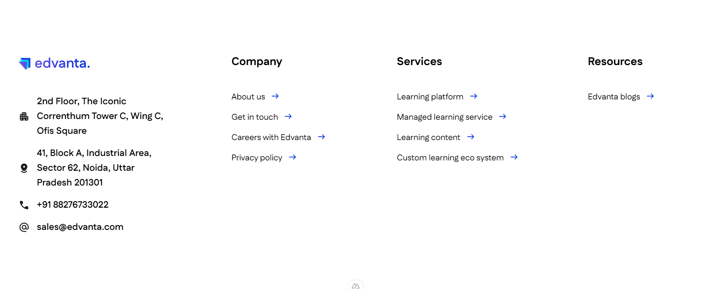
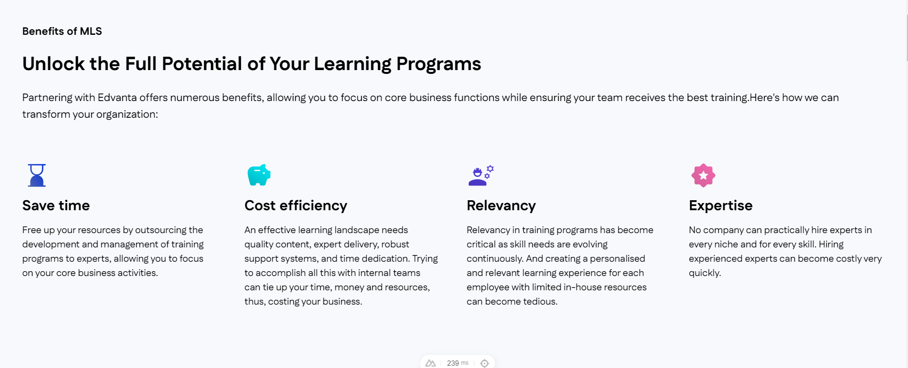
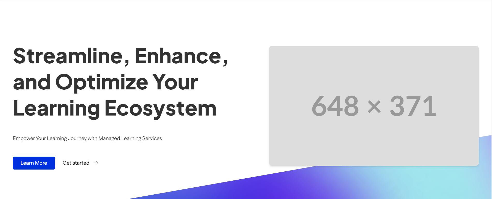
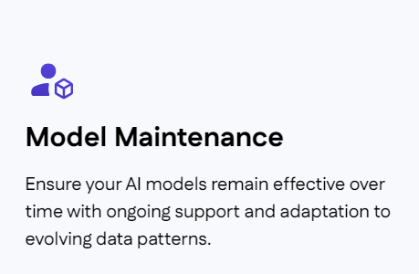
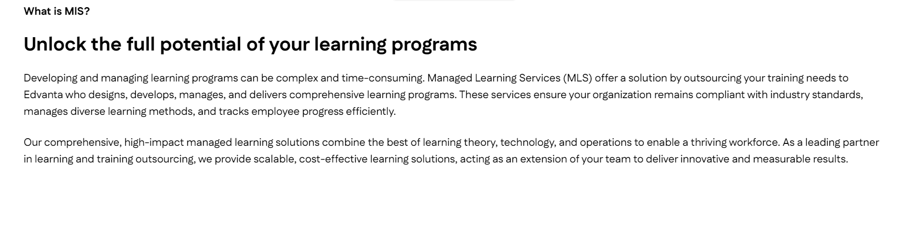
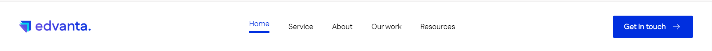

# UI Components
## Table of Contents

- [UI Components](#ui-components)
  - [Table of Contents](#table-of-contents)
  - [Button](#button)
  - [Card](#card)
  - [ConnectCard](#connectcard)
  - [Footer](#footer)
  - [GridCard](#gridcard)
  - [Hero](#hero)
  - [IconCard](#iconcard)
  - [Intro](#intro)
  - [Logo](#logo)
  - [Navbar](#navbar)


## Button

**File:** `components/ui/Button.vue`

A versatile button component with various styles, states, and sizes.



**Props:**
- `variant`: string - The style variant of the button
  - Options: 'primary' (default), 'secondary', 'tertiary', 'danger'
- `state`: string - The current state of the button
  - Options: 'default' (default), 'hover', 'active', 'disabled'
- `size`: string - The size of the button
  - Options: 'small' (default), 'medium', 'large'

**Variants:**
1. Primary: Filled button with white text
2. Secondary: Outlined button with primary text color
3. Tertiary: Subtle button with default text color
4. Danger: Filled button with white text, used for destructive actions

**States:**
1. Default: Normal appearance
2. Hover: Appearance when mouse is over the button
3. Active: Appearance when button is being clicked
4. Disabled: Appearance when button is not interactive

**Sizes:**
1. Small: Smaller text and padding
2. Medium: Standard text and padding
3. Large: Larger padding

**Usage:**
```vue
<template>
  <Button variant="primary" state="default" size="medium">
    Click me
  </Button>
</template>

<script setup>
import Button from '@/components/ui/Button.vue'
</script>
```

**Examples:**

1. Primary button (default):
```vue
<Button>Submit</Button>
```

2. Secondary button with hover state:
```vue
<Button variant="secondary" state="hover">Hover Me</Button>
```

3. Large tertiary button:
```vue
<Button variant="tertiary" size="large">Learn More</Button>
```

4. Disabled danger button:
```vue
<Button variant="danger" state="disabled">Delete</Button>
```

5. Button with icon:
```vue
<Button>
  <icon-component /> Add Item
</Button>
```

...

## Card

**File:** `components/ui/Card.vue`

A card component that displays information with an icon, title, description, and an outward arrow button.


**Props:**
- `icon`: string - The filename of the icon to display (located in the `icons/` directory)
- `title`: string - The title of the card
- `description`: string - The description text for the card
- `imgSrc`: string - (Unused in the current implementation)

**Usage:**
```vue
<template>
  <Card :title="post.title" :description="post.desc" :icon="post.icon" :img-src="post.src" />
</template>

<script setup>
import Card from '@/components/ui/Card.vue'
const { data: posts } = await useAsyncData("posts", () =>
  queryContent("posts").find()
);
</script>
```

**Note:** This component is designed to work with data from Markdown files. The props correspond to frontmatter fields in the Markdown files.

## ConnectCard

**File:** `components/ui/ConnectCard.vue`

A component that displays a section with a heading, title, subtitle, and multiple cards for connecting with the company.


**Props:**
- `heading`: string - The heading text (default: 'Connect with us')
- `title`: string - The title text (default: 'Looking to get things done?')
- `subtitle`: string - The subtitle text (default: 'Lets create the best learning experience for your business together')
- `cards`: Array - An array of card objects, each containing:
  - `id`: string - Unique identifier for the card
  - `title`: string - The title of the card
  - `content`: string - The content text of the card
  - `button`: string - The text for the card's button

**Usage:**
```vue
<template>
  <ConnectCard
    :heading="lmsConnectData.heading"
    :title="lmsConnectData.title"
    :subtitle="lmsConnectData.subtitle"
    :cards="lmsConnectData.cards"
  />
</template>

<script setup>
import ConnectCard from '@/components/ui/ConnectCard.vue'

const lmsConnectData = {
  heading: "Connect with us",
  title: "Looking to get things done?",
  subtitle: "Lets create the best learning experience for your business together",
  cards: [
    {
      id: "1",
      title: "Have a project in mind?",
      content: "Let's begin your success story together right away!",
      button: "Let's talk with team"
    },
    {
      id: "2",
      title: "Join us",
      content: "We know you are not typical and neither are we. Join our family.",
      button: "Job opening"
    },
  ],
}
</script>
```

## Footer

**File:** `components/ui/Footer.vue`

A footer component that displays company information, navigation links, and contact details.



**Props:** None

**Usage:**
```vue
<template>
  <Footer />
</template>

<script setup>
import Footer from '@/components/ui/Footer.vue'
</script>
```

**Structure:**
1. Company logo and contact information
2. "Company" links section
3. "Services" links section
4. "Resources" links section

**Notes:**
- This component uses the `UiLogo` component for the company logo.
- Navigation links use `NuxtLink` for internal routing.
- The component is responsive, adjusting its layout for different screen sizes.
- Icons are sourced from the `~/public/icons/` directory.
## GridCard

**File:** `components/ui/GridCard.vue`

Displays a grid of cards with a heading, title, and subtitle.



**Props:**
- `data`: Array - Array of objects containing card information
- `heading`: String - The section heading (default: 'Heading')
- `title`: String - The main title (default: 'Title')
- `subtitle`: String - The subtitle (default: 'Subtitle')
- `bg`: String - Background color class (default: 'bg-[#F7F9FC]')
- `text`: String - Text color class (default: 'text-inherit')
- `isDark`: Boolean - Indicates dark mode (default: false)
- `columns`: Number | String - Number of columns (default: null)

**Usage:**
```vue
<template>
  <UiGridCard 
    :data="servicesData.data" 
    :heading="servicesData.heading" 
    :title="servicesData.title"
    :subtitle="servicesData.subtitle" 
    columns="4" 
  />
</template>

<script setup>
import UiGridCard from '@/components/ui/GridCard.vue'

const servicesData = {
  heading: "Empowering Your Business with Advanced AI Solutions",
  title: "AI Services Designed for Innovation and Efficiency",
  subtitle: "Edvanta's AI Enablement services are designed to seamlessly integrate AI into your business processes, unlocking new levels of innovation and efficiency.",
  data: [
    {
      title: 'Model Development',
      description: 'Build intelligent AI models tailored to your industry needs using cutting-edge tools and technologies.',
      icon: '/icons/aiEnable/deployed_code_account.svg'
    },
    // ... more items
  ]
}
</script>
```
## Hero

**File:** `components/ui/Hero.vue`

Creates a hero section with title, subtitles, image, and call-to-action buttons.



**Props:**
- `title`: String - The main title (default: "Title")
- `subtitles`: Array - Array of strings for subtitles (default: ["subtitle"])
- `rightImg`: String - URL for the image (default: "https://placehold.co/648x371")
- `cta`: Array - Array of objects for call-to-action buttons
- `barImg`: String - URL for the background bar image (default: "/icons/hero-bar-bg.png")

**Usage:**
```vue
<template>
  <UiHero 
    :title="heroData.title" 
    :subtitles="heroData.subtitles" 
    :rightImg="heroData.rightImg" 
    :cta="heroData.cta"
    :barImg="heroData.barImg" 
  />
</template>

<script setup>
import UiHero from '@/components/ui/Hero.vue'

const heroData = {
  title: "Transform learning for teams and students alike",
  subtitles: ["Whether you're training your workforce or educating students, our Learning Management Systems provide the tools you need to inspire, engage, and drive growth."],
  rightImg: "https://placehold.co/648x371",
  cta: [
    {
      text: "Explore Our LMS",
      href: "/"
    },
    {
      text: "Schedule a consultation",
      href: "/",
    }
  ],
  barImg: "/icons/hero-bar-bg.png"
}
</script>
```
## IconCard

**File:** `components/ui/IconCard.vue`

Displays a card with an icon, title, and description.



**Props:**
- `title`: String - The card title
- `description`: String - The card description
- `isDark`: Boolean - Indicates dark mode

**Usage:**
```vue
<template>
  <UiIconCard 
    :title="section.title"
    :description="section.description" 
    :isDark="isDark"
  >
    
  </UiIconCard>
</template>

<script setup>
import UiIconCard from '@/components/ui/IconCard.vue'

const section = {
  title: 'Model Development',
  description: 'Build intelligent AI models tailored to your industry needs using cutting-edge tools and technologies.',
  icon: '/icons/aiEnable/deployed_code_account.svg'
}
const isDark = false
</script>
```
## Intro

**File:** `components/ui/Intro.vue`

Displays an introduction section with a title, heading, and content paragraphs.



**Props:**
- `title`: String - The title text (default: "Title")
- `heading`: String - The heading text (default: "Heading")
- `content`: Array - Array of paragraph strings (default: ["content"])

**Usage:**
```vue
<template>
  <UiIntro 
    :title="introData.title" 
    :heading="introData.heading" 
    :content="introData.content" 
  />
</template>

<script setup>
import UiIntro from '@/components/ui/Intro.vue'

const introData = {
  title: "AI Enablement: Transforming Potential into Performance",
  heading: "Seamlessly Integrating AI Across Your Organization",
  content: [
    "AI Enablement is more than just implementing AI—it's about embedding AI deeply into your business operations. This process aligns AI capabilities with your business goals, enhancing decision-making, driving innovation, and optimizing efficiency. At Edvanta, we collaborate with you to craft and execute AI strategies that are uniquely suited to your needs, ensuring AI is not just a tool, but a catalyst for growth across every aspect of your organization.",
    "This approach sets AI Enablement apart by focusing on strategic, integrated AI solutions that drive business success."
  ]
}
</script>
```
## Logo

**File:** `components/ui/Logo.vue`

Displays the Edvanta logo with a gradient text effect.


**Props:**
This component doesn't accept any props.

**Usage:**
```vue
<template>
  <UiLogo />
</template>

<script setup>
import UiLogo from '@/components/ui/Logo.vue'
</script>
```

## Navbar

**File:** `components/ui/Navbar.vue`

Displays a responsive navigation bar with logo, links, and a call-to-action button.



**Props:**
This component doesn't accept any props. It uses internal state to manage the active link.

**Usage:**
```vue
<template>
  <UiNavbar />
</template>

<script setup>
import UiNavbar from '@/components/ui/Navbar.vue'
</script>
```